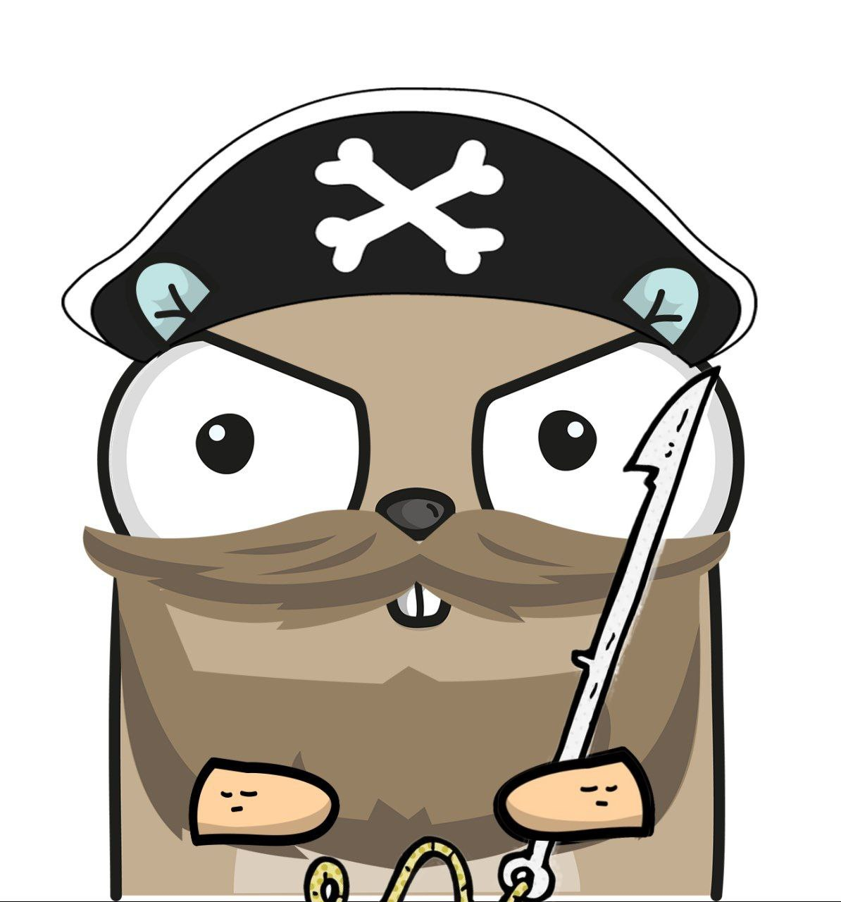

# Harpoon

    

**Harpoon** aims to capture the syscalls (as if they were fishes) from the execution of a single user-defined function.

**N.B.** This is currently a PoC made for fun in my free time. Not a production grade project.

## Introduction

This tool is designed to provide fine-grained visibility into the syscalls made by specific functions within a program. Unlike traditional system call tracing tools like `strace`, which capture all syscalls made during the entire program's execution, this project leverages the power of eBPF to pinpoint and monitor system calls exclusively within targeted functions.

## References

I would like to point out that without the references mentioned below this project would never have come to life.
For that reason, the code takes a lot of inspiration from the references listed below:

* https://www.grant.pizza/blog/tracing-go-functions-with-ebpf-part-1/
* https://itnext.io/seccomp-in-kubernetes-part-2-crafting-custom-seccomp-profiles-for-your-applications-c28c658f676e
* https://github.com/containers/oci-seccomp-bpf-hook
* *Liz Rice. Learning eBPF. O'Reilly, 2023*

